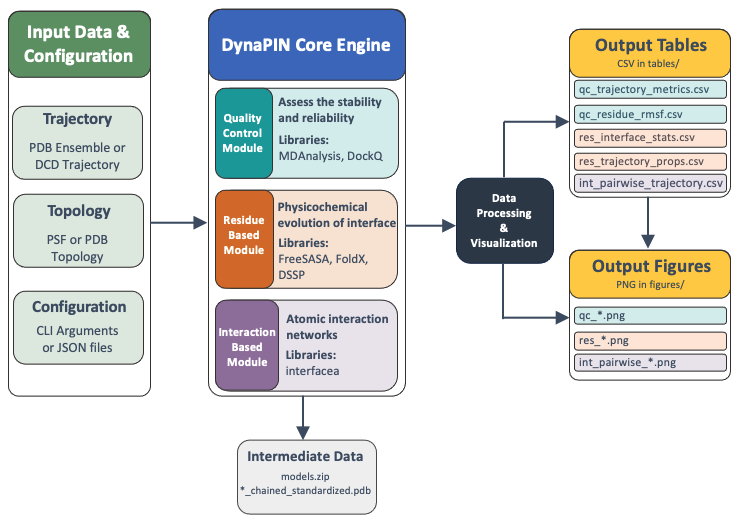

# DynaPIN: Dynamic Analysis of Protein INterfaces


**DynaPIN** is a powerful and flexible analysis pipeline designed for Molecular Dynamics (MD) simulations. It specializes in dissecting protein-protein interactions, assessing structural stability, calculating energetic contributions and intermolecular interactions at the residue level.

Whether you are running a quick quality check or a deep-dive interface analysis, DynaPIN streamlines the process from trajectory to visualization.

## 🚀 Key Features

DynaPIN performs analysis in three distinct yet integrated modules:

### 1. Quality Control
Assess the stability and reliability of your simulation.
* **Structural Metrics:** Root Mean Square Deviation (RMSD), Radius of Gyration (RG), Root Mean Square Fluctuation (RMSF).
* **Interface Quality with CAPRI Metrics:** Interface RMSD (iRMSD), Ligand RMSD (lRMSD), DockQ Score, Fraction of Native (Fnat) and Non-Native (Fnonnat) contacts.

### 2. Residue Based Analysis
Characterize the physicochemical evolution of interface residues.
* **Dynamic Classification:** Categorizes residues as Core, Rim, Support, Surface, or Interior based on the Levy (2010) model.
* **Surface Analysis:** Relative and Absolute Solvent Accessible Surface Area of complex and monomers (rASA/SASA).
* **Energetics:** Decomposition of binding energy (Van der Waals, Electrostatic) per residue using **FoldX**.
* **Secondary Structure:** Dynamic monitoring of structural changes at interface.

### 3. Interaction Based Analysis
Map the specific atomic interaction networks over time.
* **Bond Tracking:** Detects Hydrogen bonds, Hydrophobic interactions, and Salt bridges (Ionic bonds).

## 🏗 System Architecture

DynaPIN is built on a modular Python architecture, integrating powerful libraries such as **MDAnalysis** and **pdb-tools** for trajectory handling, **FreeSASA** for surface calculations, **FoldX** for energy analysis, and **DSSP** for secondary structure analysis, and **Interfacea** for interaction profiling. Results are automatically organized into tabular data (`.csv`) and visual plots (`.png`).




## 💻 System Requirements

Before installing DynaPIN, please ensure you have the following:

* **Operating System:** Linux, macOS, or Windows.
    * *Note for Windows Users:* It is recommended to use **WSL (Windows Subsystem for Linux)** for the best compatibility with DSSP.
* **Package Manager:** [Anaconda](https://www.anaconda.com/) or [Miniconda](https://docs.conda.io/en/latest/miniconda.html) is required to manage the environment.
* **Version Control:** [Git](https://git-scm.com/) is recommended for cloning the repository.
* **Python:** The package supports Python 3.10 and higher.

## 📦 Installation

DynaPIN utilizes a unified **Conda** environment to manage Python dependencies and system binaries (including the custom C-extensions for `interfacea`).

### 1. Clone the Repository
```bash
git clone https://github.com/aysebercin/DynaPIN.git
cd DynaPIN
```
### 2. Create the Environment
This command installs all necessary dependencies
```bash
conda env create -f environment.yml
conda activate dynapin
```
DynaPIN is ready to use!

## ⚡ Quick Start
DynaPIN provides a user-friendly Command Line Interface (CLI). 

### Basic Usage
Run a complete analysis pipeline (Quality Control, ResidueBased, and InteractionBased modules) with a single command:

```bash
# Using a PDB trajectory
dynapin --output_dir=TestRun --trajectory_file=sim.pdb --commands=all_analysis,all_plots

# Using a DCD trajectory with topology
dynapin --output_dir=TestRun --trajectory_file=sim.dcd --topology_file=top.psf --stride=10 --commands=all_analysis,all_plots
```

### Key Arguments

| Argument | Description |
| :--- | :--- |
| `-t`, `--trajectory_file` | Path to the input trajectory (`.dcd` or `.pdb`). |
| `--topology_file` | Topology file (`.psf`, `.pdb`) required for `.dcd` inputs. |
| `-c`, `--commands` | Modules to run (e.g., `QualityControl`, `ResidueBased`, `all_analysis`). |
| `-s`, `--stride` | Step size for reading frames (default: 1). |
| `--foldx_path` | Path to the FoldX executable (required for energy analysis). |
| `-sm`, `--split_models` | Splits multi-model PDBs into separate frames (default: True). |

---

## 📂 Output Files

DynaPIN organizes the analysis outputs into a structured directory as shown below. Results are automatically organized into `tables/` (CSV data) and `figures/` (High-quality Plots).
*(Note: `*.png` indicates multiple plot files generated for different metrics)*

```text
output_dir/
│
├── figures/                         # Visualization Plots
│   ├── int_pairwise_*.png           # Interaction frequency plots (H-bond, Hydrophobic, Ionic)
│   ├── qc_*.png                     # Quality control plots (RMSD, RMSF, DockQ, Rg, etc.)
│   └── res_*.png                    # Residue analysis plots (SASA, DSSP, FoldX, etc.)
│
├── tables/                          # Numerical Data (CSV)
│   ├── int_pairwise_trajectory.csv  # Detailed list of atomic interactions per frame
│   ├── qc_residue_rmsf.csv          # RMSF values per residue
│   ├── qc_trajectory_metrics.csv    # Time-series data for global metrics (RMSD, Rg, DockQ)
│   ├── res_interface_stats.csv      # Interface occupancy statistics (Core/Rim classification)
│   └── res_trajectory_props.csv     # Residue-wise properties (Energy, SASA, Secondary Structure)
│
├── models.zip                       # Archive of extracted PDB frames used for analysis
├── *_chained_standardized.pdb       # Pre-processed structure files
├── plot_params.json                 # Configuration used for generating plots
└── table_params.json                # Configuration used for calculations
```

---

## 🛠 External Dependencies

While the conda environment handles most libraries, please note:

**FoldX:** Due to licensing, FoldX cannot be auto-installed. Download it from [FoldX Suite](https://foldxsuite.crg.eu/) and provide the path via `--foldx_path`.

---

## 📜 Acknowledgements & Funding

This project is supported by **TÜBİTAK** (The Scientific and Technological Research Council of Türkiye) under the **2509 Bosphorus Türkiye-France Bilateral Cooperation Program** (Project No: 122N790).

Developed by the **Computational Structural Biology Lab (CSB)** at Izmir Biomedicine and Genome Center (IBG).

## 📧 Contact

If you have any questions, feedback, or issues related to DynaPIN, please feel free to contact the project team:

* **Ayşe Berçin Barlas:** [aysebercin.barlas@ibg.edu.tr](mailto:aysebercin.barlas@ibg.edu.tr)
* **Ezgi Karaca:** [ezgi.karaca@ibg.edu.tr](mailto:ezgi.karaca@ibg.edu.tr)
