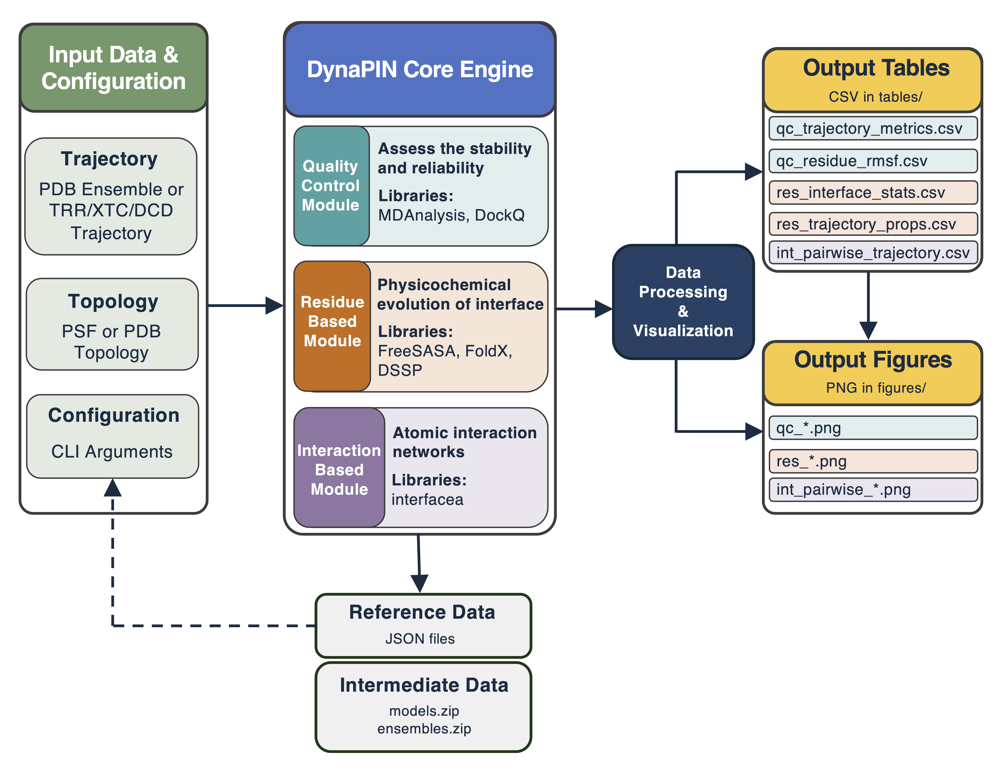

# DynaPIN: Analysis of Dynamic Protein INterfaces


**DynaPIN** is a powerful and flexible analysis pipeline designed for Molecular Dynamics (MD) simulations. It specializes in dissecting protein-protein interactions, assessing structural stability, calculating energetic contributions and intermolecular interactions at the residue level.

Whether you are running a quick quality check or a deep-dive interface analysis, DynaPIN streamlines the process from trajectory to visualization.

## 🚀 Key Features

DynaPIN performs analysis in three distinct yet integrated modules:

### 1. Quality Control
Assess the stability and reliability of your simulation.
* **Structural Metrics:** Root Mean Square Deviation (RMSD), Radius of Gyration (RG), Root Mean Square Fluctuation (RMSF).
* **Interface Quality with CAPRI Metrics:** Interface RMSD (iRMSD), Ligand RMSD (lRMSD), DockQ Score, Fraction of Native (Fnat) and Non-Native (Fnonnat) contacts.

### 2. Residue Based Analysis
Characterize the physicochemical evolution of interface residues.
* **Dynamic Classification:** Categorizes residues as Core, Rim, Support, Surface, or Interior based on the Levy (2010) model.
* **Surface Analysis:** Relative and Absolute Solvent Accessible Surface Area of complex and monomers (rASA/SASA).
* **Energetics:** Decomposition of binding energy (Van der Waals, Electrostatic) per residue using **FoldX**.
* **Secondary Structure:** Dynamic monitoring of structural changes at interface.

### 3. Interaction Based Analysis
Map the specific atomic interaction networks over time.
* **Bond Tracking:** Detects Hydrogen bonds, Hydrophobic interactions, and Salt bridges (Ionic bonds).

## 🏗 System Architecture

DynaPIN is built on an object-oriented and modular Python architecture, integrating powerful libraries such as **MDAnalysis** and **pdb-tools** for trajectory handling, **DockQ** for interface quality assessment, **FreeSASA** for accessible surface area calculations, **Fold**X for energy analysis, **DSSP** for secondary structure tracking, and **interfacea** for interaction profiling. Results are automatically organized into tabular data (`.csv`) and visual plots (`.png`).




## 💻 System Requirements

Before installing DynaPIN, please ensure you have the following:

* **Operating System:** Linux and macOS.
    * *Note for Windows Users:* It is recommended to use **WSL (Windows Subsystem for Linux)** for the best compatibility with DynaPIN.
* **Package Manager:** [Anaconda](https://www.anaconda.com/) or [Miniconda](https://docs.conda.io/en/latest/miniconda.html) is required to manage the environment.
* **Version Control:** [Git](https://git-scm.com/) is recommended for cloning the repository.
* **Python:** The package supports Python 3.10 and higher.

## 🛠 External Dependencies (Optional but Recommended)

The `dynapin` Conda environment automatically installs all core libraries. However, the energy calculation module relies on **FoldX**, which requires a separate, manual installation due to academic licensing restrictions.

**How to use FoldX with DynaPIN:**
1. Download the FoldX executable from the [FoldX Suite website](https://foldxsuite.crg.eu/).
2. When executing DynaPIN, pass the path to this executable using the `--foldx_path` argument.

> **Note:** FoldX is entirely optional. If you do not provide the `--foldx_path` argument, DynaPIN will still run perfectly, but it will automatically bypass the energy calculation module.

## 📦 Installation

DynaPIN utilizes a unified **Conda** environment to manage Python dependencies and system binaries (including the custom C-extensions for `interfacea`).

### 1. Clone the Repository
```bash
git clone https://github.com/aysebercin/DynaPIN.git
cd DynaPIN
```
### 2. Create the Environment
This command installs all necessary dependencies
```bash
conda env create -f environment.yml
conda activate dynapin
```
DynaPIN is ready to use!

## ⚡ Quick Start
DynaPIN offers two primary ways to run analyses: via the **Command Line Interface (CLI)** for standard pipelines, or through the **Python API** for interactive exploration. 

### Option 1: Command Line Interface (CLI)
Run a complete analysis pipeline (Quality Control, ResidueBased, and InteractionBased modules) with a single command:

```bash
# Using a PDB trajectory
dynapin --output_dir=TestRun --trajectory_file=sim.pdb --commands=all_analysis,all_plots

# Using a DCD trajectory with topology
dynapin --output_dir=TestRun --trajectory_file=sim.dcd --topology_file=top.psf --stride=10 --foldx_path=/path/to/foldx --commands=all_analysis,all_plots
```
### Key Arguments

| Argument | Description |
| :--- | :--- |
| `-o`, `--output_dir` | Name of the output directory where results will be saved. |
| `-t`, `--trajectory_file` | Path to the input trajectory (`.dcd`, `.xtc`, `.trr`, `.pdb`). |
| `--topology_file` | Topology file (`.psf`, `.pdb`) required for `.dcd` inputs. Be sure that your topology file includes chain identifiers. |
| `-c`, `--commands` | Modules to run (e.g., `QualityControl`, `ResidueBased`, `all_analysis`). |
| `-s`, `--stride` | Step size for reading frames (default: 1). |
| `-ch`, `--chains` | Select specific two chains for analysis in heteromers (e.g., `'A,B'`). |
| `--threshold` | Threshold percentage for dynamic interface residues (default: 50). |
| `--foldx_path` | Path to the FoldX executable (required for energy analysis). |
| `-sm`, `--split_models` | Splits multi-model PDBs into separate frames (default: True). |

### Option 2: Interactive API Workflow
Beyond the command line, DynaPIN serves as a powerful Python library. We provide a comprehensive Jupyter Notebook that demonstrates this usage, allowing for inline 3D visualization and granular control over every analysis step.

* **Notebook:** [`DynaPIN_API_workflow.ipynb`](DynaPIN_API_workflow.ipynb)
* **Use Case:** Ideal for users who prefer an interactive environment (Jupyter/Lab) or wish to integrate DynaPIN into custom Python scripts.

To run the workflow interactively:

```bash
conda activate dynapin
jupyter notebook DynaPIN_API_Workflow.ipynb
```
## 📂 Output Files

DynaPIN organizes the analysis outputs into a structured directory as shown below. Results are automatically organized into `tables/` (CSV data) and `figures/` (High-quality Plots).
*(Note: `*.png` indicates multiple plot files generated for different metrics)*

```text
output_dir/
│
├── figures/                         # Visualization Plots
│   ├── int_pairwise_*.png           # Interaction frequency plots (H-bond, Hydrophobic, Ionic)
│   ├── qc_*.png                     # Quality control plots (RMSD, RMSF, DockQ, Rg, etc.)
│   └── res_*.png                    # Residue analysis plots (SASA, DSSP, FoldX, etc.)
│
├── tables/                          # Numerical Data (CSV)
│   ├── int_pairwise_trajectory.csv  # Detailed list of atomic interactions per frame
│   ├── qc_residue_rmsf.csv          # RMSF values per residue
│   ├── qc_trajectory_metrics.csv    # Time-series data for global metrics (RMSD, Rg, DockQ)
│   ├── res_interface_stats.csv      # Interface occupancy statistics (Core/Rim classification)
│   └── res_trajectory_props.csv     # Residue-wise properties (Energy, SASA, Secondary Structure)
│
├── models.zip                       # Archive of extracted PDB frames used for analysis
├── *_fixed_standardized.pdb         # Pre-processed structure files
├── plot_params.json                 # Configuration used for generating plots
└── table_params.json                # Configuration used for calculations
```


❗The full datasets (input MD trajectories) and application examples (DynaPIN analysis outputs) for the test cases presented in our manuscript are openly available on Zenodo: [](https://doi.org/10.5281/zenodo.20180638)

This dataset includes:
- **Trajectory_Inputs/:** Raw trajectory (.dcd) and topology (.pdb) files for the Rigid, Medium, and Difficult test cases.
- **DynaPIN_Outputs/:** Full sets of outputs including tables, figures and intermediate datas generated by DynaPIN for these systems.

## 📝 Citation

DynaPIN is currently under peer review. If you use DynaPIN in your research, please cite our upcoming paper:

```bibtex
@article{barlas_dynapin_2026,
  title={DynaPIN: A tool for characterizing dynamic protein interfaces},
  author={Barlas, Ayşe Berçin and Özsan, Atakan and Prévost, Chantal and Sacquin-Mora, Sophie and Karaca, Ezgi},
  journal={Under Review},
  year={2026}
}
```

## 📚 Integrated Tools & References

DynaPIN seamlessly integrates several powerful structural analysis tools and methodologies to perform comprehensive interface profiling. If you use DynaPIN in your research, we highly encourage you to consider citing the underlying software and definitions that make this pipeline possible:

* **MDAnalysis:** Utilized for trajectory processing and core structural metrics (RMSD, RMSF, Rg).
  > Michaud-Agrawal, N., et al. (2011). *Journal of Computational Chemistry*. [DOI: 10.1002/jcc.21787](https://doi.org/10.1002/jcc.21787)
* **DockQ:** Integrated for frame-resolved CAPRI interface quality metrics (DockQ score, Fnat, i-RMSD, etc.).
  > Basu, S., & Wallner, B. (2016). *PLOS ONE*. [DOI: 10.1371/journal.pone.0161879](https://doi.org/10.1371/journal.pone.0161879)
* **FreeSASA & Levy's Interface Definition:** FreeSASA is used to compute accessible surface areas, classifying residues into core, rim, and support regions based on Levy's definition.
  > Mitternacht, S. (2016). *F1000Research*. [DOI: 10.12688/f1000research.7931.1](https://doi.org/10.12688/f1000research.7931.1)
  > Levy, E. D. (2010). *Journal of Molecular Biology*. [DOI: 10.1016/j.jmb.2010.09.028](https://doi.org/10.1016/j.jmb.2010.09.028)
* **DSSP:** Used to monitor secondary structure transitions of dynamic interface residues.
  > Hekkelman, M. L., et al. (2025). *Protein Science*. [DOI: 10.1002/pro.70208](https://doi.org/10.1002/pro.70208)
* **FoldX:** Executed on a per-frame basis to calculate van der Waals and electrostatic energy contributions.
  > Schymkowitz, J., et al. (2005). *Nucleic Acids Research*. [DOI: 10.1093/nar/gki387](https://doi.org/10.1093/nar/gki387)
* **interfacea:** Extensively optimized and employed for atomistic profiling of hydrogen bonds, salt bridges, and hydrophobic contacts.
  > Rodrigues, J., et al. (2019). *Zenodo*. [DOI: 10.5281/zenodo.3516439](https://doi.org/10.5281/zenodo.3516439)
  
## 📜 Acknowledgements & Funding

This project is supported by **TÜBİTAK** (The Scientific and Technological Research Council of Türkiye) under the **2509 Bosphorus Türkiye-France Bilateral Cooperation Program** (Project No: 122N790).

Developed by the **Computational Structural Biology Lab (CSB)** at Izmir Biomedicine and Genome Center (IBG).

## 📧 Contact

If you have any questions, feedback, or issues related to DynaPIN, please feel free to contact the project team:

* **Ayşe Berçin Barlas:** [aysebercin.barlas@ibg.edu.tr](mailto:aysebercin.barlas@ibg.edu.tr)
* **Ezgi Karaca:** [ezgi.karaca@ibg.edu.tr](mailto:ezgi.karaca@ibg.edu.tr)
